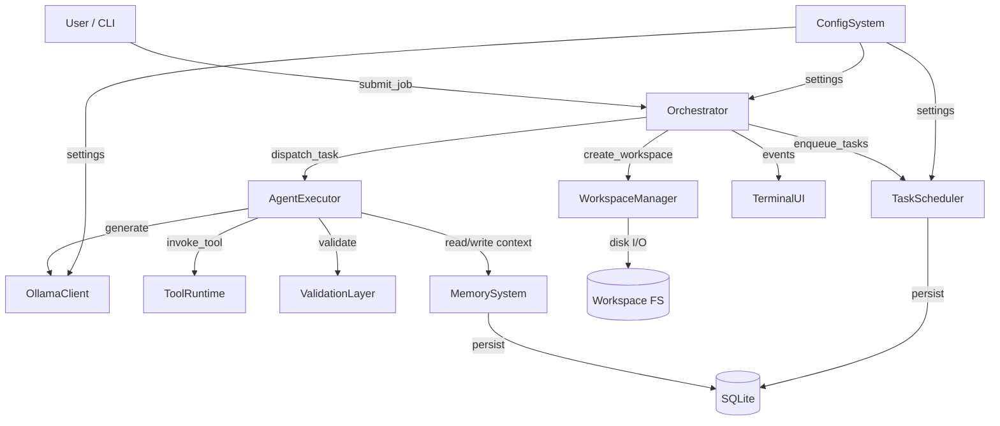
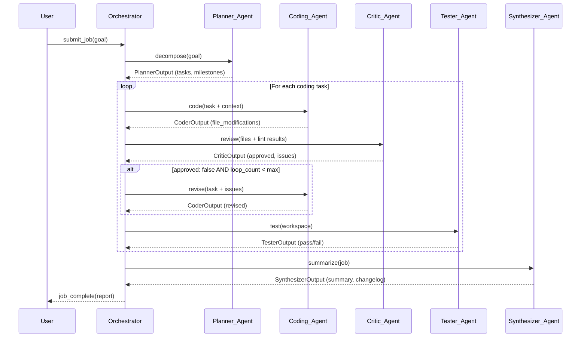

# Design Document: Ollama Fleet

## Overview

Ollama Fleet is a production-grade, asynchronous, autonomous AI orchestration platform. Users submit a high-level software project goal; the system decomposes it into a dependency-ordered task graph, dispatches tasks to specialized AI agents backed by locally-hosted Ollama LLMs, executes tools (file I/O, shell, tests), iterates through critique/revision loops, and delivers completed artifacts — all without human intervention during execution.

The system is explicitly **not** a chatbot. It is a CI/CD-style autonomous workflow engine with persistent job queues, structured agent outputs, crash-resilient resumability, and a terminal dashboard UI.

### Key Design Principles

- **Stateless agents**: Every agent invocation is self-contained. All context is injected by the Orchestrator; no agent relies on conversational history.
- **Crash resilience**: All state is committed to SQLite before any side-effecting operation. On restart, the Orchestrator replays from the last committed state.
- **Structured outputs**: Every agent returns a Pydantic-validated JSON payload. Freeform text is never parsed downstream.
- **Sandboxed tools**: All file and shell operations are path-validated and logged. No agent can escape the job workspace.
- **Phased delivery**: The system is buildable in four incremental phases, each producing a working pipeline.

---

## Architecture

### High-Level Component Diagram



### Multi-Agent Workflow Sequence



### Module / Directory Structure

```
ollama_fleet/
├── __init__.py
├── main.py                    # CLI entry point, startup, config loading
├── config.py                  # Pydantic settings, TOML loader
│
├── orchestrator/
│   ├── __init__.py
│   ├── orchestrator.py        # Job lifecycle, dispatch loop, crash recovery
│   ├── job_manager.py         # Job CRUD, state transitions
│   └── escalation.py         # Escalation detection and writing
│
├── scheduler/
│   ├── __init__.py
│   ├── task_scheduler.py      # Task queue, state machine, dependency resolution
│   └── dependency_resolver.py # DAG traversal, blocked→pending transitions
│
├── agents/
│   ├── __init__.py
│   ├── executor.py            # AgentExecutor: prompt assembly, retry, timeout
│   ├── planner.py             # Planner_Agent prompt builder
│   ├── coder.py               # Coding_Agent prompt builder
│   ├── critic.py              # Critic_Agent prompt builder
│   ├── tester.py              # Tester_Agent prompt builder
│   ├── synthesizer.py         # Synthesizer_Agent prompt builder
│   └── schemas.py             # All Pydantic output schemas
│
├── ollama/
│   ├── __init__.py
│   └── client.py              # Async httpx client, streaming, error types
│
├── tools/
│   ├── __init__.py
│   ├── runtime.py             # Tool dispatch, logging, path validation
│   ├── file_tools.py          # read_file, write_file, list_files, search_code
│   ├── shell_tools.py         # run_command, run_tests
│   └── git_tools.py           # git_diff, git_commit
│
├── validation/
│   ├── __init__.py
│   └── validator.py           # Syntax check, linting, test output parsing
│
├── memory/
│   ├── __init__.py
│   ├── memory_system.py       # Active context assembly, token budgeting
│   ├── episodic.py            # Episodic memory CRUD
│   └── long_term.py           # Long-term memory search
│
├── workspace/
│   ├── __init__.py
│   └── manager.py             # Directory creation, atomic writes, execution history
│
├── ui/
│   ├── __init__.py
│   ├── dashboard.py           # Textual/Rich app, layout, keyboard shortcuts
│   ├── panels.py              # Individual panel widgets
│   └── event_bus.py           # Async event bus for UI updates
│
└── db/
    ├── __init__.py
    ├── database.py            # SQLite connection, migrations
    └── migrations/
        ├── 001_initial.sql
        ├── 002_episodic_memory.sql
        └── 003_long_term_memory.sql
```

---

## Components and Interfaces

### Orchestrator

The Orchestrator is the central coordination component. It owns the job lifecycle state machine and the main dispatch loop.

**Job State Machine:**
```
submitted → running → completed
                   → failed
                   → cancelled
```

**Dispatch Loop (asyncio):**
```python
async def dispatch_loop(self, job_id: str) -> None:
    while True:
        if self._paused:
            await asyncio.sleep(1)
            continue
        ready_tasks = await self.scheduler.get_ready_tasks(job_id)
        for task in ready_tasks:
            asyncio.create_task(self._dispatch_task(task))
        if await self.scheduler.is_job_terminal(job_id):
            break
        await asyncio.sleep(self.config.scheduler.poll_interval)  # ≤ 5s
```

**Crash Recovery:**
On startup, the Orchestrator queries SQLite for jobs in `running` state. For each such job, it re-queues all tasks that were in `running` state as `pending` (since their in-flight execution was lost), then resumes the dispatch loop.

**Key interfaces:**
```python
class Orchestrator:
    async def submit_job(self, goal: str, config: JobConfig) -> str  # returns job_id
    async def cancel_job(self, job_id: str) -> None
    async def pause_job(self, job_id: str) -> None
    async def resume_job(self, job_id: str) -> None
    async def _dispatch_task(self, task: Task) -> None
    async def _handle_critic_output(self, task: Task, output: CriticOutput) -> None
    async def _check_stall(self, job_id: str) -> None
```

### Task Scheduler

The Task Scheduler manages the persistent task queue with atomic SQLite state transitions.

**Task State Machine:**
```
pending → running → completed
        → failed
blocked → pending  (when all deps complete)
        → failed   (when any dep fails/cancelled)
running → pending  (retry, below limit)
        → failed   (retry limit reached)
pending → cancelled
blocked → cancelled
```

**Atomic Transitions** use SQLite `BEGIN IMMEDIATE` transactions with optimistic locking via a `version` column:
```sql
UPDATE tasks
SET state = 'running', version = version + 1, dispatched_at = ?
WHERE task_id = ? AND state = 'pending' AND version = ?
```
If the update affects 0 rows, another worker claimed the task — skip it.

**Key interfaces:**
```python
class TaskScheduler:
    async def enqueue_tasks(self, tasks: list[TaskSpec]) -> None
    async def get_ready_tasks(self, job_id: str) -> list[Task]
    async def transition(self, task_id: str, new_state: TaskState, reason: str = "") -> bool
    async def increment_retry(self, task_id: str) -> int  # returns new retry count
    async def cancel_task(self, task_id: str) -> None
    async def resolve_dependencies(self, job_id: str) -> None
```

### Agent Executor

The Agent Executor assembles prompts, calls the Ollama client, validates responses, and handles retries.

**Execution flow:**
```
1. Assemble Active_Context via MemorySystem
2. Build agent-specific prompt (system + user messages)
3. Call OllamaClient.generate() with timeout
4. Parse response JSON → validate against Pydantic schema
5. On validation failure: build error-correction prompt, retry (up to retry_limit)
6. On timeout: mark task failed with reason=invocation_timeout (no retry consumed)
7. Log: full prompt, raw response, parsed output, duration
8. Return validated output to Orchestrator
```

**Key interfaces:**
```python
class AgentExecutor:
    async def execute(
        self,
        task: Task,
        agent_type: AgentType,
        extra_context: dict[str, Any] = {}
    ) -> AgentOutput
```

### Ollama Client

Async HTTP client wrapping the Ollama REST API using `httpx.AsyncClient`.

**Streaming accumulation:**
```python
async def generate(self, model: str, prompt: str, timeout: float) -> str:
    full_response = []
    async with self.client.stream("POST", "/api/generate",
                                   json={"model": model, "prompt": prompt, "format": "json"},
                                   timeout=timeout) as resp:
        async for line in resp.aiter_lines():
            chunk = json.loads(line)
            full_response.append(chunk.get("response", ""))
            if chunk.get("done"):
                break
    return "".join(full_response)
```

**Error types:**
```python
class OllamaConnectionError(Exception): ...   # unreachable, DNS, TCP timeout
class OllamaHTTPError(Exception):             # 4xx/5xx
    status_code: int
    body: str
class OllamaTimeoutError(Exception): ...      # per-request timeout exceeded
```

### Tool Runtime

Sandboxed tool execution with path validation, metacharacter filtering, and structured logging.

**Tool dispatch:**
```python
class ToolRuntime:
    async def invoke(self, tool_name: str, args: dict, task_id: str) -> ToolResult
```

**Path validation** (applied to all file tools):
```python
def _validate_path(self, path: str, workspace_root: Path) -> Path:
    resolved = (workspace_root / path).resolve()
    if not str(resolved).startswith(str(workspace_root.resolve())):
        raise PathTraversalError(path)
    return resolved
```

**Shell metacharacter filter** (applied to `run_command`):
```python
SHELL_METACHARACTERS = set(';& |><$`(){}[]*?!~')

def _validate_command(self, args: list[str]) -> None:
    for arg in args:
        if any(c in SHELL_METACHARACTERS for c in arg):
            raise ShellMetacharacterError(arg)
```

**Available tools:**

| Tool | Description | Timeout |
|------|-------------|---------|
| `read_file` | Read file contents | — |
| `write_file` | Atomic write (tmp → rename) | — |
| `list_files` | List directory contents | — |
| `search_code` | Regex search across workspace | — |
| `run_command` | Execute subprocess | configurable (default 60s) |
| `run_tests` | Run test suite, parse output | configurable |
| `git_diff` | Show git diff | — |
| `git_commit` | Commit staged changes | — |

### Validation Layer

Runs after every Coding_Agent completion, before Critic_Agent invocation.

**Validation pipeline:**
```
1. Syntax check (ast.parse for Python, language-specific for others)
2. Lint (ruff for Python; linter_unavailable warning if binary missing)
3. Write results to validation/<ISO8601_UTC>.json
4. If syntax failure: re-queue Coding_Agent task (retry counter unchanged)
5. If lint only: pass lint results to Critic_Agent context
```

**Key interfaces:**
```python
class ValidationLayer:
    async def validate(self, modified_files: list[str], workspace: Path) -> ValidationResult

@dataclass
class ValidationResult:
    syntax_ok: bool
    lint_results: list[LintIssue]
    linter_available: bool
    timestamp: str  # ISO 8601
```

### Memory System

Manages Active Context assembly with token budgeting, Episodic Memory, and Long-Term Memory.

**Active Context assembly:**
```
1. Start with task description (always included)
2. Add files referenced in task description / dependency chain
3. Add most recent N episodic memory summaries (default N=5)
4. Estimate token count (len(text) / 4)
5. If over budget: truncate oldest file contents first, then episodic summaries
6. Never inject full file tree
```

**Token budget enforcement:**
```python
def _truncate_to_budget(self, context: ActiveContext, max_tokens: int) -> ActiveContext:
    # Sort file contents by recency (oldest first for truncation)
    # Remove oldest files until under budget
    # If still over: truncate episodic summaries (oldest first)
```

**Key interfaces:**
```python
class MemorySystem:
    async def assemble_context(self, task: Task, job_id: str) -> ActiveContext
    async def save_episodic(self, entry: EpisodicEntry) -> None
    async def search_long_term(self, job_id: str, query: str) -> list[EpisodicEntry]
```

### Workspace Manager

Manages on-disk directory structure with atomic writes and append-only execution history.

**Directory structure per job:**
```
workspaces/<job_id>/
├── src/
├── tests/
├── logs/
│   └── execution_history.jsonl   # append-only event log
├── agent_outputs/
├── validation/
├── summaries/
└── metadata/
    ├── job.json
    └── escalations.json          # append-only JSON array
```

**Atomic write:**
```python
async def write_file(self, rel_path: str, content: str) -> None:
    target = self._validate_path(rel_path)
    tmp = target.with_suffix(".tmp")
    try:
        tmp.write_text(content, encoding="utf-8")
        tmp.rename(target)
    except Exception:
        if tmp.exists():
            tmp.unlink()
        raise
```

**Execution history events** (written to `logs/execution_history.jsonl`):
- `task_state_transition`
- `tool_invocation`
- `agent_invocation_start`
- `agent_invocation_end`
- `validation_result`
- `job_state_transition`

### Terminal UI

Rich/Textual-based dashboard with event-driven updates via an async event bus.

**Layout:**
```
┌─────────────────────────────────────────────────────────┐
│  Ollama Fleet  │  Job: <name>  │  Progress: 42%          │
├──────────────────────┬──────────────────────────────────┤
│  Task Queue          │  Agent Activity                   │
│  [pending] task_1    │  Coder  │ task_3 │ 12.4s │ llama3│
│  [running] task_2    │  Critic │ task_2 │  3.1s │ llama3│
│  [blocked] task_4    │                                   │
├──────────────────────┴──────────────────────────────────┤
│  Validation Results                                       │
│  ruff: 2 issues in src/app.py                            │
├─────────────────────────────────────────────────────────┤
│  Escalations  [d to dismiss]                             │
│  task_5 │ retry_limit_exceeded │ 2024-01-15T10:30:00Z   │
├─────────────────────────────────────────────────────────┤
│  Logs                                                     │
│  [10:30:01] task_3 → running                             │
│  [10:30:05] Coder invocation complete (8.2s)             │
└─────────────────────────────────────────────────────────┘
  [p] pause   [d] dismiss escalation   [q] quit
```

**Event bus:**
```python
class UIEventBus:
    async def publish(self, event: UIEvent) -> None
    async def subscribe(self, handler: Callable[[UIEvent], Awaitable[None]]) -> None
```

UI events: `TaskStateChanged`, `AgentStarted`, `AgentCompleted`, `ValidationResult`, `EscalationAdded`, `JobStateChanged`.

### Configuration System

TOML-based configuration loaded at startup, validated with Pydantic v2 settings.

**Config loading:**
```python
config_path = os.environ.get("OLLAMA_FLEET_CONFIG", "./config.toml")
settings = FleetSettings.from_toml(config_path)
```

On any validation error: write to stderr with field name + expected range, exit non-zero.

---

## Data Models

### SQLite Schema

#### `jobs` table
```sql
CREATE TABLE jobs (
    job_id          TEXT PRIMARY KEY,
    goal            TEXT NOT NULL,
    state           TEXT NOT NULL CHECK(state IN ('submitted','running','completed','failed','cancelled')),
    created_at      TEXT NOT NULL,   -- ISO 8601
    updated_at      TEXT NOT NULL,
    config_json     TEXT NOT NULL,   -- serialized JobConfig
    workspace_path  TEXT NOT NULL,
    version         INTEGER NOT NULL DEFAULT 0
);
CREATE INDEX idx_jobs_state ON jobs(state);
```

#### `tasks` table
```sql
CREATE TABLE tasks (
    task_id         TEXT PRIMARY KEY,
    job_id          TEXT NOT NULL REFERENCES jobs(job_id),
    title           TEXT NOT NULL,
    description     TEXT NOT NULL,
    agent_type      TEXT NOT NULL CHECK(agent_type IN ('planner','coder','critic','tester','synthesizer')),
    state           TEXT NOT NULL CHECK(state IN ('pending','running','completed','failed','blocked','cancelled')),
    priority        INTEGER NOT NULL DEFAULT 5,
    retry_count     INTEGER NOT NULL DEFAULT 0,
    dependencies    TEXT NOT NULL DEFAULT '[]',  -- JSON array of task_ids
    created_at      TEXT NOT NULL,
    updated_at      TEXT NOT NULL,
    dispatched_at   TEXT,
    completed_at    TEXT,
    failure_reason  TEXT,
    agent_output    TEXT,            -- serialized AgentOutput JSON
    version         INTEGER NOT NULL DEFAULT 0
);
CREATE INDEX idx_tasks_job_id ON tasks(job_id);
CREATE INDEX idx_tasks_state ON tasks(state);
CREATE INDEX idx_tasks_job_state ON tasks(job_id, state);
```

#### `episodic_memory` table
```sql
CREATE TABLE episodic_memory (
    id              INTEGER PRIMARY KEY AUTOINCREMENT,
    job_id          TEXT NOT NULL REFERENCES jobs(job_id),
    task_id         TEXT NOT NULL REFERENCES tasks(task_id),
    agent_type      TEXT NOT NULL,
    outcome         TEXT NOT NULL CHECK(outcome IN ('completed','failed')),
    files_modified  TEXT NOT NULL DEFAULT '[]',  -- JSON array of paths
    summary_text    TEXT NOT NULL,
    timestamp       TEXT NOT NULL   -- ISO 8601
);
CREATE INDEX idx_episodic_job_id ON episodic_memory(job_id);
CREATE INDEX idx_episodic_task_id ON episodic_memory(task_id);
```

#### `long_term_memory` table
```sql
CREATE TABLE long_term_memory (
    id              INTEGER PRIMARY KEY AUTOINCREMENT,
    job_id          TEXT NOT NULL,
    task_id         TEXT NOT NULL,
    summary_text    TEXT NOT NULL,
    timestamp       TEXT NOT NULL
);
CREATE INDEX idx_ltm_job_id ON long_term_memory(job_id);
-- Case-insensitive substring search via: WHERE summary_text LIKE '%query%' COLLATE NOCASE
```

#### `escalations` table
```sql
CREATE TABLE escalations (
    id              INTEGER PRIMARY KEY AUTOINCREMENT,
    task_id         TEXT NOT NULL,
    job_id          TEXT NOT NULL,
    reason          TEXT NOT NULL,
    retry_count     INTEGER NOT NULL,
    timestamp       TEXT NOT NULL,   -- ISO 8601
    dismissed       INTEGER NOT NULL DEFAULT 0
);
CREATE INDEX idx_escalations_job_id ON escalations(job_id);
```

### Pydantic Agent Output Schemas

```python
from pydantic import BaseModel, Field
from typing import Literal

# --- Planner ---
class PlannerTask(BaseModel):
    task_id: str
    title: str
    description: str
    agent_type: Literal["coder", "tester", "synthesizer"]
    dependencies: list[str] = []
    priority: int = Field(ge=1, le=10)

class PlannerOutput(BaseModel):
    tasks: list[PlannerTask]
    milestones: list[str]
    architecture_notes: str

# --- Coder ---
class FileModification(BaseModel):
    file_path: str
    operation: Literal["create", "modify", "delete"]
    content: str  # empty string when operation == "delete"

class CoderOutput(BaseModel):
    file_modifications: list[FileModification]
    summary: str
    confidence_score: float = Field(ge=0.0, le=1.0)

# --- Critic ---
class CriticIssue(BaseModel):
    file_path: str
    line_number: int  # 0 = file-level issue
    severity: Literal["critical", "major", "minor"]
    description: str
    suggested_fix: str

class CriticOutput(BaseModel):
    approved: bool
    issues: list[CriticIssue]
    overall_assessment: str

# --- Tester ---
class TestFailure(BaseModel):
    test_name: str
    error_message: str
    suggested_fix: str

class TesterOutput(BaseModel):
    tests_passed: int
    tests_failed: int
    failures: list[TestFailure]
    ready_for_review: bool

# --- Synthesizer ---
class SynthesizerOutput(BaseModel):
    summary: str
    changelog: list[str]
    files_produced: list[str]
    next_steps: list[str]

# Union type for all agent outputs
AgentOutput = PlannerOutput | CoderOutput | CriticOutput | TesterOutput | SynthesizerOutput
```

### Pydantic Configuration Schema

```python
from pydantic_settings import BaseSettings
from pydantic import Field

class OllamaConfig(BaseModel):
    base_url: str = "http://localhost:11434"
    planner_model: str = "llama3"
    coder_model: str = "llama3"
    summarizer_model: str = "llama3"
    critic_model: str | None = None   # defaults to coder_model
    tester_model: str | None = None   # defaults to coder_model
    timeout: float = Field(default=600.0, ge=300.0, le=3600.0)

class SchedulerConfig(BaseModel):
    retry_limit: int = Field(default=3, ge=1, le=10)
    max_concurrent_tasks: int = Field(default=4, ge=1, le=32)
    poll_interval: float = Field(default=5.0, ge=0.1, le=5.0)
    max_critique_revision_loops: int = Field(default=3, ge=1, le=10)
    stall_timeout: float = Field(default=600.0, ge=1.0)

class MemoryConfig(BaseModel):
    max_context_tokens: int = Field(default=8192, ge=1024, le=131072)
    episodic_window: int = Field(default=5, ge=1)

class WorkspaceConfig(BaseModel):
    base_path: str = "./workspaces"

class UIConfig(BaseModel):
    refresh_rate: float = Field(default=1.0, ge=0.1, le=10.0)

class ToolsConfig(BaseModel):
    command_timeout: int = Field(default=60, ge=1, le=3600)
    git_enabled: bool = True

class FleetSettings(BaseModel):
    ollama: OllamaConfig = OllamaConfig()
    scheduler: SchedulerConfig = SchedulerConfig()
    memory: MemoryConfig = MemoryConfig()
    workspace: WorkspaceConfig = WorkspaceConfig()
    ui: UIConfig = UIConfig()
    tools: ToolsConfig = ToolsConfig()

    @classmethod
    def from_toml(cls, path: str) -> "FleetSettings": ...
```

---

## Correctness Properties

*A property is a characteristic or behavior that should hold true across all valid executions of a system — essentially, a formal statement about what the system should do. Properties serve as the bridge between human-readable specifications and machine-verifiable correctness guarantees.*

### Property 1: Job ID Uniqueness

*For any* set of N concurrent or sequential job submissions with any goal strings, all returned Job IDs SHALL be distinct — no two submissions may produce the same Job ID.

**Validates: Requirements 1.2**

---

### Property 2: Job Terminal State Convergence

*For any* job with any set of tasks, when every task in the job has reached a terminal state (`completed` or `failed` or `cancelled`), the job itself SHALL be in a terminal state.

**Validates: Requirements 1.5**

---

### Property 3: Crash Recovery Consistency

*For any* job state persisted to SQLite at the moment of a simulated process crash, after restart the Orchestrator SHALL produce a state where: (a) all tasks that were `running` at crash time are now `pending`, and (b) all tasks that were already in a terminal state remain in that terminal state unchanged.

**Validates: Requirements 1.7**

---

### Property 4: Cancellation Completeness

*For any* job with any distribution of task states, when a cancellation is requested, every task that was in a non-terminal state (`pending`, `running`, `blocked`) SHALL transition to `cancelled`, and every task already in a terminal state SHALL remain unchanged.

**Validates: Requirements 1.8**

---

### Property 5: Task State Persistence Round-Trip

*For any* task created with any valid state value from the set `{pending, running, completed, failed, blocked, cancelled}`, writing the task to SQLite and reading it back SHALL produce a record with the identical state value.

**Validates: Requirements 2.1**

---

### Property 6: Dependency Unblocking Invariant

*For any* task dependency graph, when all direct dependencies of a `blocked` task reach the `completed` state, that task SHALL transition to `pending`. Conversely, when any direct dependency reaches `failed` or `cancelled`, the `blocked` task SHALL transition to `failed` with the blocking dependency ID recorded as the failure reason.

**Validates: Requirements 2.2, 2.8**

---

### Property 7: Retry Counter Monotonicity

*For any* task with `retry_count` in `[0, retry_limit - 1]`, when the task fails, the retry counter SHALL increment by exactly 1 and the task SHALL be re-queued as `pending`. The counter SHALL never decrease and SHALL never exceed `retry_limit`.

**Validates: Requirements 2.3**

---

### Property 8: Atomic Dispatch Exclusivity

*For any* task in `pending` state, when N concurrent coroutines simultaneously attempt to transition it to `running`, exactly one SHALL succeed and the remaining N-1 SHALL observe a no-op (0 rows updated). The task's `version` counter SHALL increment by exactly 1.

**Validates: Requirements 2.5**

---

### Property 9: Dispatch Record Completeness

*For any* agent type and any dispatched task, the task record in SQLite SHALL contain a non-null `dispatched_at` timestamp and the correct `agent_type` value immediately after dispatch.

**Validates: Requirements 2.6**

---

### Property 10: Schema Validation Retry with Logging

*For any* malformed JSON response from the Ollama client (any response that fails Pydantic validation for the expected agent schema), the Agent_Executor SHALL: (a) log the raw response and the validation error details, (b) retry with an error-correction prompt that includes the validation error, and (c) consume exactly one schema-validation retry attempt per failure. The total number of schema-validation retries SHALL not exceed `retry_limit`.

**Validates: Requirements 3.3, 5.6**

---

### Property 11: Timeout Independence from Schema Retries

*For any* sequence of invocation attempts on a single task where some attempts end in timeout and others end in schema validation failure, the schema-validation retry counter SHALL be incremented only by schema failures — timeout failures SHALL NOT increment the schema retry counter.

**Validates: Requirements 3.8**

---

### Property 12: Streaming Accumulation Correctness

*For any* response string partitioned into any number of chunks (including a single chunk and many small chunks), the Ollama client's streaming accumulator SHALL produce a result equal to the concatenation of all `response` fields from chunks received before `"done": true`.

**Validates: Requirements 4.3**

---

### Property 13: HTTP Error Typed Exception Mapping

*For any* HTTP response with a status code in the range `[400, 599]`, the Ollama client SHALL raise an `OllamaHTTPError` containing the exact status code and response body. For connection-level failures (refused, DNS, TCP timeout), it SHALL raise `OllamaConnectionError`. No other exception types SHALL propagate to the Agent_Executor.

**Validates: Requirements 4.4**

---

### Property 14: Agent Output Schema Round-Trip

*For any* valid instance of any agent output type (`PlannerOutput`, `CoderOutput`, `CriticOutput`, `TesterOutput`, `SynthesizerOutput`), serializing the instance to JSON via `model.model_dump_json()` and deserializing back via `Model.model_validate_json()` SHALL produce an object equal to the original instance.

**Validates: Requirements 5.1, 5.2, 5.3, 5.4, 5.5**

---

### Property 15: Critique Revision Issue Injection

*For any* `CriticOutput` with `approved: false` and any non-empty list of issues, the revision `CoderOutput` task prompt assembled by the Orchestrator SHALL contain every issue from the critic's issue list — no issue SHALL be silently dropped regardless of severity.

**Validates: Requirements 6.2**

---

### Property 16: Critique Loop Termination

*For any* configured `max_critique_revision_loops` value in `[1, 10]`, if the Critic_Agent returns `approved: false` on every invocation, the Orchestrator SHALL stop the loop after exactly `max_critique_revision_loops` iterations and SHALL NOT invoke the Coding_Agent a `max_critique_revision_loops + 1`th time.

**Validates: Requirements 6.4**

---

### Property 17: Path Traversal Rejection

*For any* file path argument passed to any Tool_Runtime or Workspace_Manager file operation, if the resolved absolute path falls outside the job's workspace root directory, the operation SHALL return a structured error with `error_type: "path_traversal"` and SHALL NOT perform any read, write, or delete on the filesystem.

**Validates: Requirements 7.2, 10.5**

---

### Property 18: Shell Metacharacter Rejection

*For any* `run_command` invocation where any argument string contains any character from the set `{; & | > < $ \` ( ) { } [ ] * ? ! ~}`, the Tool_Runtime SHALL return a validation error and SHALL NOT spawn a subprocess.

**Validates: Requirements 7.7**

---

### Property 19: Syntax Failure Does Not Consume Retry

*For any* Coding_Agent task that produces a syntactically invalid file, after the Validation_Layer rejects it and re-queues the task, the task's `retry_count` SHALL be identical to its value before the failed invocation.

**Validates: Requirements 8.3**

---

### Property 20: Active Context Episodic Window

*For any* episodic memory history of size M and any configured window size N, the Active_Context assembled for a task SHALL contain exactly `min(M, N)` episodic summaries — always the most recent N entries, never more than N.

**Validates: Requirements 9.1**

---

### Property 21: Active Context Token Budget Truncation Order

*For any* assembled Active_Context that exceeds the configured `max_context_tokens` limit, the truncation algorithm SHALL remove file contents before episodic summaries, and within file contents SHALL remove the oldest files first, until the estimated token count is at or below the budget.

**Validates: Requirements 9.3**

---

### Property 22: Atomic Write Integrity

*For any* file content written via `Workspace_Manager.write_file`, if the write operation fails at any point (including after the temp file is written but before the rename), the target file SHALL either contain the new content (success) or its pre-write content (failure) — never a partial write. Any temporary file created during a failed write SHALL be deleted.

**Validates: Requirements 10.3**

---

### Property 23: Config Validation Error Completeness

*For any* configuration file containing an invalid field value, the error written to stderr SHALL contain the field name and the expected type or valid range. The process SHALL exit with a non-zero status code before any job execution begins.

**Validates: Requirements 12.3, 12.4**

---

### Property 24: Identical Output Loop Detection

*For any* Coding_Agent task, if the complete set of `file_modifications` in the agent's output is byte-for-byte identical to the output from the immediately preceding invocation of the same task, the Orchestrator SHALL mark the task as `failed` rather than re-queuing it.

**Validates: Requirements 13.1**

---

### Property 25: Escalation Record Field Completeness

*For any* escalated task or job, the escalation record written to `metadata/escalations.json` and the `escalations` SQLite table SHALL contain all five required fields: `task_id`, `job_id`, `reason`, `retry_count`, and `timestamp` (ISO 8601). No field SHALL be null or missing.

**Validates: Requirements 13.2**

---

### Property 26: Low-Confidence Routing

*For any* `CoderOutput` with a `confidence_score` strictly below the configured threshold (default 0.4), the Orchestrator SHALL route the task through a Critic_Agent review before advancing to the Tester_Agent, regardless of whether the task was already scheduled for critic review.

**Validates: Requirements 13.5**

---

## Error Handling

### Error Taxonomy

| Error Class | Source | Handling |
|---|---|---|
| `OllamaConnectionError` | Ollama client | Mark task failed, reason=`ollama_unreachable` |
| `OllamaHTTPError` | Ollama client | Mark task failed, reason=`ollama_http_error:<status>` |
| `OllamaTimeoutError` | Ollama client | Mark task failed, reason=`invocation_timeout` (no retry consumed) |
| `PydanticValidationError` | Agent executor | Retry with error-correction prompt (up to retry_limit) |
| `PathTraversalError` | Tool runtime / Workspace | Return structured error, do not execute |
| `ShellMetacharacterError` | Tool runtime | Return structured error, do not execute |
| `SubprocessTimeoutError` | Tool runtime | Terminate subprocess, return timeout result |
| `WorkspaceCreationError` | Workspace manager | Transition job to failed before planner invocation |
| `AtomicWriteError` | Workspace manager | Delete tmp file, propagate structured error |
| `LinterUnavailableWarning` | Validation layer | Record warning, proceed without lint results |
| `SyntaxValidationError` | Validation layer | Re-queue task, do NOT increment retry counter |
| `ConfigValidationError` | Config system | Write to stderr with field+range, exit non-zero |

### Error Propagation Rules

1. **Agent-level errors** (Ollama errors, validation failures) are caught by `AgentExecutor` and translated to task state transitions. They never propagate to the Orchestrator as unhandled exceptions.
2. **Tool errors** are always returned as structured `ToolResult` objects with an `error_type` field. Tools never raise unhandled exceptions to the agent.
3. **Workspace errors** during job creation cause immediate job failure before any agent is invoked.
4. **Config errors** cause process exit before any job execution.
5. **Unhandled exceptions** in the dispatch loop are caught at the Orchestrator level, logged to `logs/execution_history.jsonl`, and cause the affected task to be marked `failed`.

### Critique/Revision Loop Failure Modes

```
Critic returns approved:false → revision task created
  ↓ (if loop_count < max)
Coding_Agent revision → Critic review
  ↓ (if loop_count == max AND still not approved)
Escalation written → task marked failed
  ↓
Terminal_UI escalation panel displayed
```

### Stall Detection

The Orchestrator runs a background coroutine that checks the last task state transition timestamp for each running job every 60 seconds. If `now - last_transition > stall_timeout`, an escalation is written and the job is marked failed.

---

## Testing Strategy

### Dual Testing Approach

The testing strategy combines unit tests for specific examples and edge cases with property-based tests for universal correctness guarantees.

**Property-Based Testing Library:** [Hypothesis](https://hypothesis.readthedocs.io/) (Python)

Each property test runs a minimum of 100 iterations. Tests are tagged with the design property they validate.

### Unit Tests

Unit tests cover:
- Specific workflow sequences (agent invocation order, state machine transitions)
- Integration points between components (executor → client, scheduler → DB)
- Error conditions (timeout handling, workspace creation failure, config errors)
- Configuration loading (env var fallback, missing file, invalid values)

### Property-Based Tests

Each correctness property maps to exactly one Hypothesis test. Tag format:
`# Feature: ollama-fleet, Property {N}: {property_title}`

| Property | Test Focus | Hypothesis Strategy |
|---|---|---|
| P1: Job ID Uniqueness | `submit_job` × N | `st.lists(st.text(), min_size=2)` |
| P2: Job Terminal Convergence | Task state sets | `st.lists(st.sampled_from(['completed','failed','cancelled']))` |
| P3: Crash Recovery | Job/task state snapshots | `st.fixed_dictionaries(...)` with running tasks |
| P4: Cancellation Completeness | Mixed task state distributions | `st.lists(st.sampled_from(ALL_STATES))` |
| P5: Task State Round-Trip | All valid states | `st.sampled_from(TaskState)` |
| P6: Dependency Unblocking | Random DAGs | Custom `st.composite` DAG generator |
| P7: Retry Counter Monotonicity | Retry counts in [0, limit-1] | `st.integers(min_value=0)` |
| P8: Atomic Dispatch Exclusivity | Concurrent coroutines | `asyncio.gather` with N=10–50 |
| P9: Dispatch Record Completeness | All agent types | `st.sampled_from(AgentType)` |
| P10: Schema Validation Retry+Log | Malformed JSON shapes | `st.text()` + `st.binary()` |
| P11: Timeout/Schema Counter Independence | Mixed failure sequences | `st.lists(st.sampled_from(['timeout','schema']))` |
| P12: Streaming Accumulation | Response partitions | `st.text()` + random partition |
| P13: HTTP Error Mapping | Status codes 400–599 | `st.integers(min_value=400, max_value=599)` |
| P14: Agent Schema Round-Trip | Valid schema instances | Hypothesis `builds()` for each schema |
| P15: Issue Injection Completeness | Issue lists | `st.lists(st.builds(CriticIssue, ...))` |
| P16: Loop Termination | max_loops in [1,10] | `st.integers(min_value=1, max_value=10)` |
| P17: Path Traversal Rejection | Path strings | `st.text()` including `../` sequences |
| P18: Metacharacter Rejection | Command args | `st.text()` seeded with metacharacters |
| P19: Syntax Failure No Retry | Invalid Python files | `st.text()` (invalid syntax) |
| P20: Episodic Window | History size M, window N | `st.integers(min_value=0, max_value=20)` × 2 |
| P21: Token Budget Truncation Order | Context compositions | `st.lists(st.builds(FileContent, ...))` |
| P22: Atomic Write Integrity | File contents + failure injection | `st.text()` + mock rename failure |
| P23: Config Error Completeness | Invalid config values | `st.fixed_dictionaries(...)` with out-of-range values |
| P24: Identical Output Detection | CoderOutput instances | `st.builds(CoderOutput, ...)` |
| P25: Escalation Field Completeness | Escalation triggers | `st.builds(Task, ...)` |
| P26: Low-Confidence Routing | Confidence scores | `st.floats(min_value=0.0, max_value=0.39)` |

### Integration Tests

Integration tests (1–3 examples each) cover:
- Full job lifecycle against a real SQLite database
- Ollama client against a mock HTTP server (respx)
- Tool runtime executing real subprocesses in a temp workspace
- Workspace manager creating and writing real directories

### Test Configuration

```toml
# pytest.ini / pyproject.toml
[tool.pytest.ini_options]
asyncio_mode = "auto"

[tool.hypothesis]
max_examples = 100
deriving = "best"
```

---

## Phased Implementation Plan

### Phase 1: Core Pipeline (Planner → Coder → Tester)

**Deliverables:**
- `config.py`: FleetSettings with TOML loading and Pydantic validation
- `db/database.py`: SQLite connection, `jobs` and `tasks` tables (migration 001)
- `ollama/client.py`: Async httpx client, streaming, typed errors
- `agents/schemas.py`: PlannerOutput, CoderOutput, TesterOutput schemas
- `agents/executor.py`: Prompt assembly, schema validation, retry, timeout, logging
- `workspace/manager.py`: Directory creation, atomic writes, execution history
- `tools/runtime.py` + `tools/file_tools.py` + `tools/shell_tools.py`: Core tools
- `orchestrator/orchestrator.py`: Job submission, dispatch loop (no critic/synthesizer)
- `scheduler/task_scheduler.py`: Basic queue, state transitions, no dependency resolution
- `ui/dashboard.py`: Basic Rich layout, task queue, log panel
- `main.py`: CLI entry point

**Phase 1 acceptance:** A submitted job runs Planner → Coder → Tester, persists all state to SQLite, and displays progress in Terminal_UI.

### Phase 2: Critique Loop + Validation + Synthesizer

**Deliverables:**
- `agents/critic.py` + `agents/synthesizer.py`: New agent prompt builders
- `agents/schemas.py`: Add CriticOutput, SynthesizerOutput
- `validation/validator.py`: Syntax check, ruff linting, test output parsing
- `orchestrator/orchestrator.py`: Critique/revision loop logic, confidence-score routing stub
- `ui/panels.py`: Validation results panel, escalation panel
- `db/migrations/002_episodic_memory.sql`: Episodic memory table

**Phase 2 acceptance:** Full Planner → Coder → Critic → Revision → Tester → Synthesizer pipeline with validation.

### Phase 3: Crash Resilience + Dependency Tracking + Episodic Memory

**Deliverables:**
- `orchestrator/orchestrator.py`: Crash recovery on startup (re-queue running tasks)
- `scheduler/dependency_resolver.py`: DAG traversal, blocked→pending transitions, cascade failures
- `memory/episodic.py`: Episodic memory CRUD
- `memory/memory_system.py`: Active context assembly with episodic summaries
- `orchestrator/escalation.py`: Stall detection, escalation writing
- `db/migrations/002_episodic_memory.sql`: Finalized

**Phase 3 acceptance:** Jobs resume correctly after simulated crash; dependency-ordered task graphs execute correctly; episodic memory is injected into agent prompts.

### Phase 4: Advanced Context + Confidence Routing + Long-Term Memory

**Deliverables:**
- `memory/memory_system.py`: Token budget enforcement with truncation priority order; Phase 4 compression (summarization to ≤50% of max_context_tokens)
- `memory/long_term.py`: Long-term memory search (case-insensitive substring)
- `orchestrator/orchestrator.py`: Confidence-score-based routing (< threshold → extra critic review)
- `db/migrations/003_long_term_memory.sql`: Long-term memory table
- `db/migrations/`: All migration scripts tested for backward compatibility

**Phase 4 acceptance:** Active context stays within token budget via summarization; low-confidence outputs are automatically routed through additional critic review; long-term memory is searchable.

### Backward Compatibility

Each phase migration script must:
1. Use `ALTER TABLE ... ADD COLUMN` with defaults (never drop columns)
2. Be idempotent (safe to run twice)
3. Leave all existing job/task records readable by the new schema version

Phase N+1 components are imported conditionally:
```python
try:
    from ollama_fleet.agents.critic import CriticAgent
    CRITIC_AVAILABLE = True
except ImportError:
    CRITIC_AVAILABLE = False
```

---

## Key Design Decisions and Tradeoffs

### SQLite over PostgreSQL

**Decision:** Use SQLite as the sole persistence layer.

**Rationale:** Ollama Fleet is a local-first tool. SQLite eliminates the operational burden of running a separate database server, is sufficient for the expected concurrency (single-user, ≤32 concurrent tasks), and provides ACID guarantees adequate for the atomic state transitions required. The `BEGIN IMMEDIATE` + optimistic locking pattern handles the concurrency requirements without needing row-level locking.

**Tradeoff:** SQLite's write serialization means high-concurrency scenarios (>32 tasks) would require migration to PostgreSQL. This is acceptable for the target use case.

### Stateless Agents with Full Context Injection

**Decision:** Every agent invocation is stateless; all context is injected by the Orchestrator.

**Rationale:** Stateless agents are independently testable, composable, and crash-safe. There is no hidden state that can diverge between the agent and the Orchestrator. The cost is larger prompts, mitigated by the Active Context token budget system.

**Tradeoff:** Large context windows increase per-invocation latency and token cost. The token budget system (Property 21) bounds this.

### Pydantic v2 for All Schemas

**Decision:** Use Pydantic v2 for all agent output schemas, configuration, and internal data models.

**Rationale:** Pydantic v2 provides fast validation, clear error messages (used in error-correction prompts), and JSON schema generation (used to constrain Ollama's `format` parameter). The `model_dump_json()` / `model_validate_json()` round-trip is the basis for Property 14.

### httpx AsyncClient for Ollama

**Decision:** Use `httpx.AsyncClient` with streaming for Ollama communication.

**Rationale:** `httpx` is the standard async HTTP client for Python 3.12+, supports streaming natively, and integrates cleanly with `asyncio`. The streaming accumulation pattern (Property 12) handles Ollama's line-delimited JSON streaming format.

### Rich/Textual for Terminal UI

**Decision:** Use Textual (built on Rich) for the terminal dashboard.

**Rationale:** Textual provides a reactive, event-driven UI model that maps cleanly to the async event bus architecture. It handles terminal resize, keyboard input, and panel layout without manual cursor management.

### Async Event Bus for UI Updates

**Decision:** Decouple the Orchestrator from the Terminal UI via an async event bus.

**Rationale:** Direct coupling between the Orchestrator and UI would make the Orchestrator untestable in isolation and would block execution if the UI is slow. The event bus allows the UI to be replaced or disabled (e.g., in headless CI mode) without changing the Orchestrator.

### Atomic Writes via Temp-File Rename

**Decision:** All file writes use the write-to-temp-then-rename pattern.

**Rationale:** On POSIX systems, `rename()` is atomic at the filesystem level. This guarantees that readers never see a partially-written file (Property 22). The temp file is always cleaned up on failure.

### Optimistic Locking for Task Dispatch

**Decision:** Use a `version` column with `UPDATE ... WHERE version = ?` for atomic task dispatch.

**Rationale:** This prevents two concurrent dispatch coroutines from both claiming the same task (Property 8) without requiring SQLite's serialized write mode to be the only concurrency control. It is simpler than advisory locks and works correctly with SQLite's `BEGIN IMMEDIATE`.
